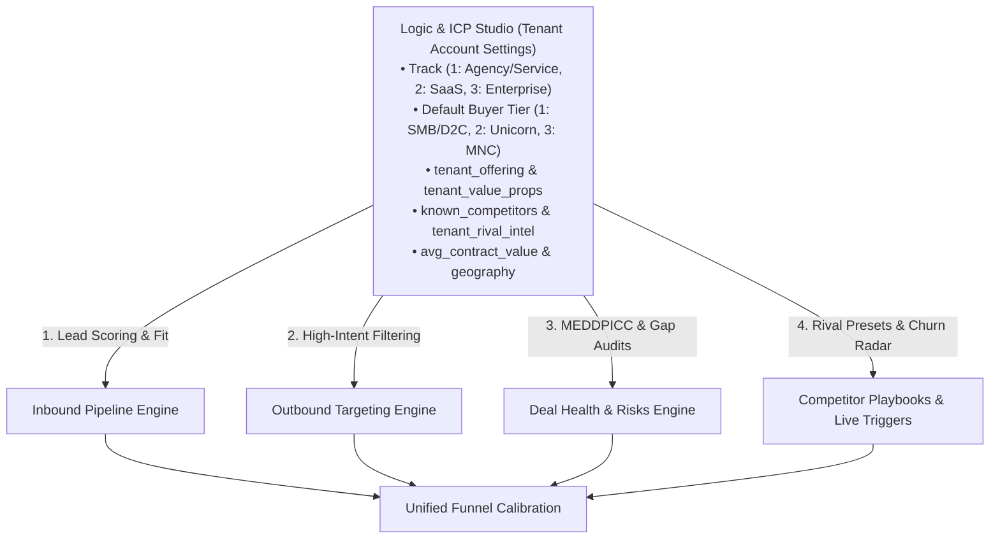

# Whipstitch — Competitor Playbooks & Live Triggers (`/battlecards`)
## Master Multi-Tenant Strategy, Legal Defamation Safeguards & AI Engineering Manual (V3)

> **Document Type:** Master Strategy Runbook, Defamation Defense Architecture & Engineering Specification  
> **Prepared For:** Enterprise Advisory, Legal & Commercial Leadership, Agency Directors & Engineering Team  
> **Target Audience:** Account Executives (AEs), Sales Development Reps (SDRs), Solo Operators & RevOps  
> **Core Architecture:** Customer-Facing Multi-Tenant Intelligence Engine with Legal Defamation Guards  
> **Associated Code Files:**  
> - Frontend: [`CompetitorBattlecards.jsx`](file:///c:/Users/ASUS/OneDrive/Desktop/vscProgram/Whipstitch/frontend/src/pages/CompetitorBattlecards.jsx)  
> - Orchestrator: [`blackboard_orchestrator.py`](file:///c:/Users/ASUS/OneDrive/Desktop/vscProgram/Whipstitch/app/services/battlecards/blackboard_orchestrator.py)  
> - Signal Agent: [`autonomous_signal_agent.py`](file:///c:/Users/ASUS/OneDrive/Desktop/vscProgram/Whipstitch/app/services/signals/autonomous_signal_agent.py)  
> - Pydantic Schemas: [`battlecard_schemas.py`](file:///c:/Users/ASUS/OneDrive/Desktop/vscProgram/Whipstitch/app/models/battlecard_schemas.py)  
> - REST APIs: [`battlecards.py`](file:///c:/Users/ASUS/OneDrive/Desktop/vscProgram/Whipstitch/app/api/v1/battlecards.py) & [`signals.py`](file:///c:/Users/ASUS/OneDrive/Desktop/vscProgram/Whipstitch/app/api/v1/signals.py)  
> - Test Suite: [`test_battlecard_blackboard.py`](file:///c:/Users/ASUS/OneDrive/Desktop/vscProgram/Whipstitch/tests/unit/test_battlecard_blackboard.py) & [`test_signal_agent.py`](file:///c:/Users/ASUS/OneDrive/Desktop/vscProgram/Whipstitch/tests/unit/test_signal_agent.py)  

---

## Executive Summary & Strategic Fixes (V3 Realignment)

In early prototype builds, the Battlecards tab suffered from two critical architectural hazards:
1. **The Category Error:** It was selling Whipstitch (ZoomInfo, Apollo, waterfall APIs) instead of selling the tenant's actual services.
2. **The Defamation Liability Surface:** When generating dynamic battlecards against real, named small agencies, consultancies, or freelancers typed in by a tenant, an LLM could fabricate checkable, false, and legally actionable claims ("Rival X's clients report slow turnaround", "their team is only 3 people") and hand them to a sales rep to assert out loud on recorded calls.

This V3 specification completely resolves these hazards by introducing:
* **Option (a) Customer-Facing Multi-Tenant Engine:** Quarantining Whipstitch's own self-selling scripts to an internal sandbox.
* **The Legal Defamation Safeguard Split:** Distinguishing strictly between `tenant_verified_intel`, `category_structural_pattern`, and `socratic_inquiry`.
* **The 4th Spoke on ICP Studio:** Full inheritance of `tenant_offering`, `tenant_value_props`, `known_competitors`, `avg_contract_value`, and geography.
* **Universal Competitive Archetypes:** Named rivals, In-House DIY Hire, and Status Quo (missing festive launch windows).
* **7th Seasonal Urgency Trigger:** Configurable seasonal calendar (Diwali/EOSS for India; Black Friday/Q4 Holiday for US/Global).
* **Tight Churn Detection:** Dropping bare `"pitching"` in favor of multi-word phrase matching to prevent false positives.
* **Transparent Computed Math:** Computing delay costs from tenant-configured contract values (`avg_contract_value × 1.25x`) rather than ungrounded static placeholders.

---

## Table of Contents
1. [The Defamation Defense Architecture (Legal & Claim Safety)](#1-the-defamation-defense-architecture-legal--claim-safety)
2. [The 4th Spoke: ICP Studio as Single Source of Truth](#2-the-4th-spoke-icp-studio-as-single-source-of-truth)
3. [The 4 Reframed Competitor Archetypes & Empty States](#3-the-4-reframed-competitor-archetypes--empty-states)
4. [The 7-Signal Real-Time Radar & Configurable Seasonal Calendars](#4-the-7-signal-real-time-radar--configurable-seasonal-calendars)
5. [Tier-Aware Reweighting & False-Positive Churn Prevention](#5-tier-aware-reweighting--false-positive-churn-prevention)
6. [Honest Math: Computed vs. Benchmark Financial Leakage](#6-honest-math-computed-vs-benchmark-financial-leakage)
7. [Visual Layout & UI Workspace Tour](#7-visual-layout--ui-workspace-tour)
8. [The 4 Core Workspace Tabs](#8-the-4-core-workspace-tabs)
9. [Exact Dynamic AI System Prompts & Injection Templates](#9-exact-dynamic-ai-system-prompts--injection-templates)
10. [End-to-End User Journeys (3 Case Studies)](#10-end-to-end-user-journeys-3-case-studies)
11. [Automated Verification & Unit Test Suite](#11-automated-verification--unit-test-suite)

---

## 1. The Defamation Defense Architecture (Legal & Claim Safety)

### The Legal Problem
When battlecards are pre-written by human lawyers for massive public corporations (e.g. ZoomInfo, Salesforce), claims rely on public SEC filings, published pricing sheets, and cited benchmarks. 

However, in a multi-tenant platform where an agency types in `"Schbang"` or a local boutique rival, having an LLM synthesize *"The Flaw They Hide"* and *"What to Say Word-for-Word"* creates acute legal risk. If an unverified LLM asserts checkable, false, and derogatory operational facts about an identifiable business (e.g. *"They have high staff turnover and missed 30% of client deadlines"*), the tenant and platform face direct exposure to **commercial disparagement and tortious interference**.

### The Solution: The 3-Tier Evidence Basis Split
Whipstitch implements an architectural split mirroring Deal Health's transcript verification:

```
┌────────────────────────────────────────────────────────────────────────────────────────┐
│                        LEGAL DEFAMATION SAFEGUARD TAXONOMY                             │
├──────────────────────────┬──────────────────────────┬──────────────────────────────────┤
│ Evidence Basis           │ What Is Generated        │ Permissible Scope                │
├──────────────────────────┼──────────────────────────┼──────────────────────────────────┤
│ 1. Socratic Discovery    │ Probing questions only   │ ALWAYS ALLOWED. Never asserts    │
│    (`socratic_inquiry`)  │ ("Ask who their assigned │ a fact; puts the burden of proof │
│                          │  senior editor will be") │ on the buyer's own diligence.    │
├──────────────────────────┼──────────────────────────┼──────────────────────────────────┤
│ 2. Category Structural   │ High-level structural    │ DEFAULT PATH. Never attacks the  │
│    Pattern               │ trade-offs of the model  │ named entity; describes standard │
│    (`category_pattern`)  │ ("Retainers at this scale│ category trade-offs (junior-to-  │
│                          │  often juggle 20+ brands")│ senior ratios, review delays).  │
├──────────────────────────┼──────────────────────────┼──────────────────────────────────┤
│ 3. Verified Tenant Intel │ Specific observed fact   │ ONLY ALLOWED if tenant supplied  │
│    (`tenant_verified`)   │ ("Requires 100% advance  │ it in ICP Studio (`rival_intel`).│
│                          │  and withholds raw files")│ Marked with an audit badge.     │
└──────────────────────────┴──────────────────────────┴──────────────────────────────────┘
```

#### Code Enforcement in [`blackboard_orchestrator.py`](file:///c:/Users/ASUS/OneDrive/Desktop/vscProgram/Whipstitch/app/services/battlecards/blackboard_orchestrator.py#L320-L340):
```python
if tenant_rival_intel and tenant_rival_intel.strip():
    claim_basis = "tenant_verified_intel"
    vulnerability = f"Tenant-verified operational constraint: {tenant_rival_intel.strip()}"
    soundbite = f"While {competitor_name} approaches this with known operational constraints ({tenant_rival_intel.strip()}), {seller} guarantees direct senior execution."
else:
    claim_basis = "category_structural_pattern"
    vulnerability = f"Category structural pattern: Full-service provider models at this scale typically carry high account-to-lead ratios, creating review bottlenecks during peak seasonal rushes."
    soundbite = f"Instead of generalist provider factories where accounts get queued behind high volume, {seller} embeds a dedicated team focused specifically on {offering} with verified turnaround SLAs."
```

In the UI, every trap card renders an explicit **`Verified Tenant Intel`** (emerald) or **`Category Pattern`** (slate) badge, providing sales reps with clear legal boundaries on calls.

---

## 2. The 4th Spoke: ICP Studio as Single Source of Truth

**Competitor Battlecards & Live Triggers** connects directly as the **4th Spoke** of **Logic & ICP Studio** (`TenantConfigStudio.jsx`):



### Configuration Fields in [`TenantConfigSchema`](file:///c:/Users/ASUS/OneDrive/Desktop/vscProgram/Whipstitch/app/models/schemas.py):
* `tenant_offering`: The product or service the tenant sells (e.g., *"Performance Creative & Influencer Retainers"*).
* `tenant_value_props`: List of structural advantages (e.g. sub-48hr turnarounds, proprietary ROAS tracking).
* `known_competitors`: List of 2–3 actual market rivals (e.g. `["Schbang", "Dentsu Creative"]`).
* `tenant_rival_intel`: Optional dictionary of verified experiences per competitor.
* `avg_contract_value`: Average deal value used for honest mathematical projections.
* `geography`: `India` vs `US` / `Global` (determines default seasonal calendar).

---

## 3. The 4 Reframed Competitor Archetypes & Empty States

Whipstitch structures competition across **4 Universal Archetypes**:

```
┌────────────────────────────────────────────────────────────────────────────────────────┐
│                        THE 4 UNIVERSAL COMPETITOR ARCHETYPES                           │
├──────────────────────────┬──────────────────────────┬──────────────────────────────────┤
│ Archetype                │ Track 1: Agency/Service  │ Track 2: B2B SaaS / Product      │
├──────────────────────────┼──────────────────────────┼──────────────────────────────────┤
│ 1. Primary Named Rival   │ Named Rival Agency       │ Direct SaaS Competitor           │
│    (known_competitors[0])│ (e.g. Schbang / Dentsu)  │ (e.g. Clevertap / WebEngage)     │
├──────────────────────────┼──────────────────────────┼──────────────────────────────────┤
│ 2. Budget Alternative    │ Cheap Freelancer / BPO   │ Self-Serve Point Solution        │
│    (known_competitors[1])│ (Low-cost outsourcing)   │ (Commodity feature tool)         │
├──────────────────────────┼──────────────────────────┼──────────────────────────────────┤
│ 3. In-House DIY Build    │ In-House Creator Hire    │ Internal Engineering Scripts     │
│    (Universal Archetype) │ (Client hires 1 creator) │ (Devs write custom Zapier code)  │
├──────────────────────────┼──────────────────────────┼──────────────────────────────────┤
│ 4. Status Quo / Inaction │ Delaying Campaign Launch │ Manual Spreadsheet Process       │
│    (Universal Archetype) │ (Missing festive Diwali) │ (Reps cherry-picking leads)      │
└──────────────────────────┴──────────────────────────┴──────────────────────────────────┘
```

### The Unconfigured Empty State
If a brand-new tenant has not yet configured `known_competitors` in ICP Studio:
* **The system does NOT silently fall back to ZoomInfo/Apollo.**
* **The system displays a clear invitation banner:**
  > *"No Competitors Configured Yet — Add your top 2–3 market rivals in Logic & ICP Studio to unlock custom battlecard playbooks and real-time competitor churn radar."*
* The 2 Universal Archetypes (**In-House DIY** and **Status Quo**) remain immediately usable, since they do not depend on named rivals.

---

## 4. The 7-Signal Real-Time Radar & Configurable Seasonal Calendars

Deal Health’s Implicated Pain pillar identified **"seasonal deadlines (Diwali launch, IPL season, EOSS, Black Friday)"** as the **#1 deal urgency driver**. The signal radar implements this natively:

| # | Signal Key | UI Badge & Color | Viability Boost | Primary Buying Catalyst |
|---|---|---|---|---|
| **1** | `seasonal_campaign_window` | **Seasonal Window** (Amber) | **+30 pts** | Diwali ramp, Republic Day, EOSS, IPL, Black Friday, Q4 Peak. |
| **2** | `leadership_shift` | **Leadership Move** (Blue) | **+25 pts** | New CMO, VP Growth, or Head of Brand appointed. |
| **3** | `capital_expansion` | **Funding / Expansion** (Emerald) | **+30 pts** | Series A/B/C closed, aggressive growth mandate. |
| **4** | `incumbent_churn` | **Competitor Churn Risk** (Rose) | **+25 pts** | Verified churn phrases or rival agency review. |
| **5** | `tech_stack_migration` | **Tech Stack Shift** (Slate) | **+5 to +20 pts** | CRM migration (HubSpot/Salesforce) — Tier 3 only. |
| **6** | `compliance_infosec` | **Security & Compliance** (Purple) | **+5 to +25 pts** | SOC2, vendor audits — Tier 3 only. |
| **7** | `velocity_surge` | **Traffic Surge** (Slate) | **+20 pts** | Inbound lead spike or sudden viral campaign surge. |

### Configurable Seasonal Calendars (Beyond India)
Implemented in [`autonomous_signal_agent.py`](file:///c:/Users/ASUS/OneDrive/Desktop/vscProgram/Whipstitch/app/services/signals/autonomous_signal_agent.py#L148-L157):
```python
if seasonal_calendar:
    active_calendar = [s.lower().strip() for s in seasonal_calendar]
elif geography and geography.lower() in ("us", "usa", "uk", "europe", "global"):
    active_calendar = ["q4 holiday", "black friday", "cyber monday", "super bowl", "back to school", "end of fiscal year", "summer peak", "holiday campaign"]
else:
    active_calendar = ["diwali", "festive season", "eoss", "end of season", "ipl", "holiday campaign", "republic day", "independence day", "navratri", "dussehra"]
```

---

## 5. Tier-Aware Reweighting & False-Positive Churn Prevention

### A. Tier Reweighting (Eliminating Enterprise MNC Bias)
* **Tier 1 (Founder-Led SMB / D2C):**
  - `seasonal_campaign_window`: **+30 pts** (Highest Priority)
  - `capital_expansion`: **+30 pts**
  - `incumbent_churn`: **+25 pts**
  - `tech_stack_migration` & `compliance_infosec`: **Demoted to +5 pts** (Suppressed).
* **Tier 2 (Growth-Stage / Unicorn):**
  - `seasonal_campaign_window`: **+30 pts**
  - `capital_expansion`: **+30 pts**
  - `leadership_shift`: **+25 pts**
* **Tier 3 (Enterprise / Global MNC):**
  - `compliance_infosec`: **+25 pts**
  - `tech_stack_migration`: **+20 pts**

### B. Dropping the Bare `"pitching"` Token
Previously, the single token `"pitching"` was in the keyword list. This caused massive false positives whenever companies pitched venture capitalists or pitched new products.

In [`autonomous_signal_agent.py`](file:///c:/Users/ASUS/OneDrive/Desktop/vscProgram/Whipstitch/app/services/signals/autonomous_signal_agent.py#L140-L146), bare `"pitching"` has been replaced with tight multi-word phrases:
```python
competitor_keywords = [
    "churn", "renewal", "dissatisfied", "agency review", "pitching agencies",
    "in a pitch process", "agency pitch", "replacing agency", "reviewing agencies",
    "vendor review", "rfp out", "poor roas", "slow turnaround", "bad data", "overage", "bounce"
]
if known_competitors:
    for comp in known_competitors:
        competitor_keywords.append(comp.lower().strip())
```
* **"VentureFlow founder seen pitching Sand Hill Road investors"** ➔ Correctly ignored (NOT churn).
* **"BrandCorp confirms it is in a pitch process for new creative partners"** ➔ Correctly flags `incumbent_churn` (+25 pts).

---

## 6. Honest Math: Computed vs. Benchmark Financial Leakage

To eliminate fabricated precision dressed as fact, financial leakage figures are generated with **explicit arithmetic and data disclosure**:

### Formula:
$$\text{Computed Delay Loss} = \text{Average Contract Value} \times 1.25\text{ (Seasonal Delay Multiplier)}$$

1. **If `avg_contract_value` is set in ICP Studio (e.g. ₹20 Lakhs):**
   - Result: `₹25,00,000 (₹25 Lakhs)`.
   - UI Label: *"Computed from your configured Average Contract Value (₹20,00,000 × 1.25x seasonal delay multiplier = ₹25,00,000)"*.
2. **If `avg_contract_value` is not set:**
   - Result: Scaled per Tier (₹18L Tier 1 / ₹65L Tier 2 / ₹2.5Cr Tier 3).
   - UI Label: *"Benchmark Reference: Tier 1 standard baseline (₹18,00,000); set Average Contract Value in ICP Studio for custom modeling"*.

---

## 7. Visual Layout & UI Workspace Tour

```
┌─────────────────────────────────────────────────────────────────────────────────────────────┐
│ ⚔ Competitor Playbooks & Live Triggers                      [ + New Competitor Playbook ]   │
│   Rep cheat sheets, objection handling scripts, and real-time triggers to win against rivals│
├─────────────────────────────────────────────────────────────────────────────────────────────┤
│ Choose Competitor or Alternative:                                     AI-Generated Playbook │
│ ┌──────────────────────┐ ┌──────────────────────┐ ┌─────────────────────┐ ┌────────────────┐│
│ │ Schbang / Legacy Firm│ │ Budget Freelancer    │ │ In-House Creative   │ │ Status Quo     ││
│ │ Primary Named Rival  │ │ Low-Cost Alternative │ │ Client DIY Hire     │ │ Delayed Launch ││
│ └──────────────────────┘ └──────────────────────┘ └─────────────────────┘ └────────────────┘│
├─────────────────────────────────────────────────────────────────────────────────────────────┤
│ [🎯 Silver Bullets & Traps (2)] [📚 5-Step Strategy] [❓ Objection Sheet (2)] [⚡ Triggers (7)]│
├─────────────────────────────────────────────────────────────────────────────────────────────┤
│ ┌─────────────────────────────────────────────────────────────────────────────────────────┐ │
│ │ THE WINNING ANGLE (EXECUTIVE SUMMARY)                                                   │ │
│ │ Trifid Media delivers specialized Performance Creative with verified turnaround SLAs,    │ │
│ │ whereas Schbang relies on generalist category workflows with operational overhead.      │ │
│ │ Their Pricing Weakness: Bloated retainer minimums, rigid scope lock-ins, slow reviews.  │ │
│ └─────────────────────────────────────────────────────────────────────────────────────────┘ │
│ ┌──────────────────────────────────────────────┐ ┌────────────────────────────────────────┐ │
│ │ 1 The Operational Bottleneck                 │ │ 2 The Retainer Lock-In Trap            │ │
│ │   [CATEGORY PATTERN]       [THE TRAP TO SET] │ │   [CATEGORY PATTERN]   [THE TRAP TO SET]│ │
│ │ WHAT THEY TELL BUYERS:                       │ │ WHAT THEY TELL BUYERS:                  │ │
│ │ "We handle everything under one roof..."     │ │ "6-month minimum retainer commitment"   │ │
│ │ THE FLAW THEY HIDE:                          │ │ THE FLAW THEY HIDE:                     │ │
│ │ Full-service retainers carry high account    │ │ Massive budget burn if performance lags │ │
│ │ ratios, creating peak seasonal bottlenecks.  │ │                                         │ │
│ │ THE TRAP QUESTION TO ASK (ON YOUR CALL):     │ │ THE TRAP QUESTION TO ASK (ON YOUR CALL):│ │
│ │ "When your Q3 campaign is 10 days away, will │ │ "Can you pause the retainer if supply   │ │
│ │  their senior team personally review edits?" │ │  chain issues stall inventory?"         │ │
│ │ WHAT TO SAY (WORD-FOR-WORD):                 │ │ WHAT TO SAY (WORD-FOR-WORD):            │ │
│ │ "Instead of generalist factories where ads   │ │ "Sprint-based pricing with transparent  │ │
│ │  get queued, our team dedicates direct focus"│ │  milestones and verified SLAs..."       │ │
│ │ Proof: 3.4x faster turnaround   [Copy Script]│ │ Proof: Saves ₹25,00,000    [Copy Script]│ │
│ └──────────────────────────────────────────────┘ └────────────────────────────────────────┘ │
└─────────────────────────────────────────────────────────────────────────────────────────────┘
```

---

## 8. The 4 Core Workspace Tabs

### Tab 1: Silver Bullets & Traps (Kill-Shots)
* **Evidence Basis Badges:** Clear demarcation of `Verified Tenant Intel` vs `Category Pattern`.
* **Trap Questions:** Socratic discovery questions that lead buyers to question the competitor's capacity.
* **Verbatim Soundbite:** Diplomatic, non-adversarial response positioning tenant advantages.
* **Copy Script Button:** 1-click clipboard ready.

### Tab 2: 5-Step Deal Strategy (Blackboard Pipeline)
* **01 Context:** Evaluates why the prospect is considering the rival.
* **02 Pressure:** Focuses on upcoming seasonal launch deadlines.
* **03 Differentiation:** Injects tenant's core value props.
* **04 Operational Data:** Displays calculated leakage with transparent footnote disclosure.
* **05 Seller Action Brief:** Recommends a 7-day pilot sprint.

### Tab 3: Objection Cheat Sheet
* **Root Cause Decomposition:** Analyzes the psychological fear behind buyer pushbacks.
* **Talk-Track:** Reassuring, ego-preserving pivot.
* **Proof Points:** Grounded in tenant's outcome metrics.

### Tab 4: Live Buying Triggers
* **7 Telemetry Triggers:** Including geography-tailored seasonal windows.
* **Viability Boost:** Mathematically reweighted by Buyer Tier.
* **Pre-Drafted Message Hooks:** 35-word conversation starters.

---

## 9. Exact Dynamic AI System Prompts & Injection Templates

---

### Prompt 1: Dynamic Kill-Shot & Trap Inversion Engine (With Defamation Defense)

```markdown
SYSTEM PROMPT:
You are the Chief Competitive Strategist for {seller_company}.
Our business sells: {tenant_offering}
Our structural value propositions are:
{tenant_value_props}

RIVAL EVALUATED: {competitor_name}
TENANT VERIFIED INTEL: {tenant_rival_intel or "None provided"}

DEFAMATION & LEGAL DIRECTIVES (CRITICAL):
1. If "TENANT VERIFIED INTEL" is "None provided":
   - NEVER fabricate specific factual assertions about {competitor_name} (do not claim specific employee counts, revenue numbers, client losses, or executive behavior).
   - Base all claims strictly on CATEGORY STRUCTURAL PATTERNS common to full-service generalist providers at this scale (e.g. account manager spread, multi-layered approvals).
   - Set evidence_basis = "category_structural_pattern".
2. If "TENANT VERIFIED INTEL" contains verified notes:
   - Anchor the operational constraint directly to the tenant's notes.
   - Set evidence_basis = "tenant_verified_intel".
3. TRAP QUESTIONS must be Socratic inquiries ("Ask who..."), never factual assertions.

INPUT PAYLOAD:
- Competitor: {competitor_name}
- Prospect: {buyer_company}
- Buyer Tier: {buyer_tier}
- Currency: {currency}

RESPONSE FORMAT (JSON adhering to BattlecardKillShot):
{
  "title": "Short descriptive title of the landmine",
  "the_trap": "What the competitor claims to buyers...",
  "the_vulnerability": "The category structural pattern or tenant-verified constraint...",
  "the_counter_strike": "The exact Socratic question for the rep to ask on the call...",
  "verbatim_soundbite": "What the rep says word-for-word positioning our offering...",
  "evidence_proof": "Verified client benchmark metric...",
  "evidence_basis": "category_structural_pattern"
}
```

---

### Prompt 2: 5-Stage Sequential Blackboard Reasoning Pipeline

```markdown
SYSTEM PROMPT:
You are the Executive Blackboard Reasoning Engine for {seller_company} pitching {tenant_offering}.
Execute the 5 sequential deal stages:

STAGE 1: OPPORTUNITY CONTEXT ENGINE
- Evaluate why {buyer_company} is evaluating {competitor_name}.

STAGE 2: PRESSURE & CATALYST ENGINE
- Identify the external seasonal catalyst (Diwali/EOSS or Black Friday depending on geography).

STAGE 3: DIFFERENTIATION ENGINE
- Formulate structural edge from our pillars: {tenant_value_props}.

STAGE 4: OPERATIONAL DATA ENGINE
- Calculate financial ROI in {currency}.
- If avg_contract_value is provided, calculate: avg_contract_value * 1.25 delay loss.
- Include explicit leakage_calculation_basis disclosure string.

STAGE 5: SELLER ACTION BRIEF
- Prescribe a 7-day pilot sprint play.

RESPONSE FORMAT:
List of 5 BlackboardStageResult objects.
```

---

### Prompt 3: Autonomous 7-Signal Classifier (Tight Phrase Defense)

```markdown
SYSTEM PROMPT:
You are an autonomous Account Trigger Intelligence Agent monitoring telemetry for {seller_company}.
We pitch: {tenant_offering}
Known rivals: {known_competitors}

TAXONOMY DIRECTIVES:
1. Classify incoming telemetry into EXACTLY ONE of the 7 triggers:
   - seasonal_campaign_window (festive seasons based on active calendar {active_calendar})
   - leadership_shift
   - capital_expansion
   - incumbent_churn (MUST match verified dissatisfaction phrases or rival names; NEVER trigger on bare 'pitching')
   - tech_stack_migration
   - compliance_infosec
   - velocity_surge
2. Calculate boost score according to Buyer Tier {buyer_tier}.
3. Draft a 35-word non-spammy conversation hook connecting the event to {tenant_offering}.

RESPONSE FORMAT (JSON adhering to AccountSignal):
{
  "id": "sig-xxxxxx",
  "account_name": "{account_name}",
  "signal_type": "one_of_seven_types",
  "headline": "{headline}",
  "snippet": "{snippet}",
  "confidence_score": 95,
  "opportunity_viability_boost": 30,
  "recommended_sales_play": "Strategic directive...",
  "pre_drafted_hook": "Warm, personalized opening line...",
  "buyer_tier": {buyer_tier}
}
```

---

## 10. End-to-End User Journeys (3 Case Studies)

### Case Study A: Trifid Media India (Digital Creative & Influencer Agency, Mumbai)
* **Offering:** Performance Creative & Creator Whitelisting Retainers (Track 1).
* **Rivals Configured:** Schbang, In-House Creator Hire, Doing Nothing.
* **Contract Value:** ₹20,00,000 (₹20 Lakhs).
* **Defamation Safety:** No specific intel entered for Schbang ➔ Card automatically generates safe Category Patterns (account congestion during Diwali rush).
* **Computed Math:** Transparently shows ₹25,00,000 delay impact (₹20L × 1.25x).

### Case Study B: US B2B SaaS Account (Overseas Expansion)
* **Geography:** US · Currency: USD ($).
* **Seasonal Calendar:** Black Friday / Q4 Holiday / Super Bowl.
* **Signal Alert:** Radar detects `seasonal_campaign_window`: *"US Brand Prepares E-commerce Infrastructure for Black Friday Cyber Monday Push"* (+30 pts).
* **Empty State Test:** When a new user signs up without competitors, named cards invite them to configure rivals while In-House and Status Quo remain immediately available.

### Case Study C: Independent Growth Consultant (Solo Operator)
* **Offering:** Fractional CMO & Growth Strategy.
* **Team Structure:** Solo Operator.
* **UI Metric:** Displays `Billable Hours Unlocked / Wk: 8 hrs`.

---

## 11. Automated Verification & Unit Test Suite

Whipstitch enforces strict automated test verification across both unit and integration suites:

```bash
# Run complete test suite (Unit & Integration)
pytest tests/unit/ tests/integration/
```

### Key Regression Tests Added:
1. `test_defamation_prevention_evidence_basis()`: Verifies that unverified rivals strictly produce `category_structural_pattern` to prevent legal defamation, while tenant notes produce `tenant_verified_intel`.
2. `test_transparent_computed_leakage_math()`: Verifies arithmetic computation (`avg_contract_value × 1.25x`) vs benchmark standard disclosures.
3. `test_empty_known_competitors_empty_state()`: Confirms unconfigured tenants see an explicit invitation empty state and universal archetypes, never falling back to ZoomInfo.
4. `test_pitching_false_positive_prevention()`: Confirms general business news with `"pitching"` does not trigger `incumbent_churn`, while tight phrases (`"in a pitch process"`, `"agency review"`) do.
5. `test_configurable_seasonal_calendar()`: Confirms US geography triggers on Black Friday / Q4 Holiday, while India triggers on Diwali / IPL.

---

*Whipstitch — Autonomous Multi-Tenant Revenue Intelligence & Competitive Superiority.*
