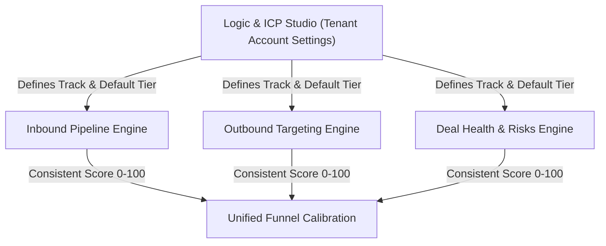

# Whipstitch: Deal Health & Risk Intelligence Engine
## Executive GTM Strategy Briefing & Engineering Specification (V3)
**Prepared for:** Strategic Business Consultant (BCG / Enterprise GTM Advisory) & Lead Engineers  
**Target Audience:** Commercial Leadership, B2B Founders, Agency Directors & Engineering Team  
**Date:** September 2026  
**Document Status:** Final Verified Architecture & Engineering Blueprint (Ready for Build)  

---

## Executive Summary

**Whipstitch** is an autonomous revenue intelligence and pipeline orchestration engine. The focal screen under strategic review is the **Deal Health & Risks Console** (`/deal-health` · `DealHealth.jsx`), designed to serve as an objective "Deal Doctor & MRI" for active B2B sales cycles.

### The Core Problem It Solves
In B2B sales, reps consistently suffer from "happy ears"—overestimating closing probability based on pleasant conversational sentiment rather than verifiable commercial commitments. The result is a **40%+ quarterly forecast error rate**. Deals stall because:
1. The real **budget signer** was never engaged.
2. The **procurement/paper hurdles** (advance payments, GST verification, or enterprise MSAs) were discovered too late.
3. The rep remained **single-threaded** (relying on one friendly champion who lacks real authority).

Whipstitch addresses this by parsing raw meeting transcripts, auditing the deal against structured sales qualification pillars, tracking won-deal benchmarks, auto-discovering missing stakeholders, and producing immediate, high-leverage follow-up scripts.

---

## 1. The Core Realignment: The 2-Axis ICP Framework

Sales deals do not fail along a simple "product vs. service" divide. An agency selling an SEO or performance marketing retainer to a 15-person D2C brand and the same agency selling to a hyper-growth unicorn (e.g., Zepto, Swiggy, Blinkit) have identical products, but **completely different buying committees, approval barriers, and deal-killing dynamics**.

```
┌────────────────────────────────────────────────────────────────────────────────────────┐
│                        THE 2-AXIS QUALIFICATION MATRIX                                 │
├────────────────────────────────────────────────────────────────────────────────────────┤
│ AXIS 1: WHAT YOU SELL (Business Model Track — Set at Tenant Account Level)             │
│ • Track 1: Service / Retainer (Agencies, Freelancers, Consultancies) ➔ [V1 LAUNCH]   │
│ • Track 2: B2B SaaS / Product (Subscription ARR) ➔ [Post-V1 Expansion]                 │
│ • Track 3: Enterprise Tech / Systems Integration (US Enterprise) ➔ [Global Expansion]  │
├────────────────────────────────────────────────────────────────────────────────────────┤
│ AXIS 2: WHO YOU SELL TO (Buyer Sophistication Tier — Selected Per Deal)                │
│ Sets how high the bar is to satisfy each qualification pillar:                         │
└────────────────────────────────────────────────────────────────────────────────────────┘
```

### The 3 Buyer Sophistication Tiers (For Track 1: Service / Retainer):

| Parameter | **Buyer Tier 1**<br>Founder-Led SMB / D2C | **Buyer Tier 2**<br>Growth-Stage / Unicorn (Zepto Scale) | **Buyer Tier 3**<br>Enterprise / MNC Buyer |
|---|---|---|---|
| **Target Customer** | 10–50 person brands, early startups, direct D2C | High-growth scale-ups, funded tech, quick-commerce | Public companies, global multinationals |
| **Economic Buyer** | Founder / MD / Promoter (WhatsApp-reachable) | VP / Function Head + Finance sign-off | Corporate Commercial Signer / Finance Board |
| **Paper Process** | SOW scope lock + GST invoice + **50% advance** | SOW + light procurement + finance PO | Master SOW + Vendor Registration + PO terms |
| **Decision Process**| Single step: "Founder confirms & pays advance" | 2–3 steps: Function Head ➔ Finance PO | Formal empanelment & procurement sequence |
| **Sales Cycle** | 1 to 3 weeks | 3 to 6 weeks | 2 to 6 months |
| **Committee Size** | 1 to 2 people | 3 to 4 people | 5+ people |
| **Primary Deal Killer**| Founder never saw pitch; advance unpaid | Bureaucracy between Brand Head & Finance | Vendor empanelment lag; commercial impasse |

> **V1 Scope Boundary**: Build **Track 1 (Service/Retainer) with Buyer Tiers 1–3**. This covers 100% of day-one target users (digital agencies, marketing freelancers, creative shops, and B2B services) without over-engineering subscription SaaS tracks prematurely. Track 3 (the existing US enterprise rubric) is preserved in the codebase as a future unlock for overseas accounts.

---

## 2. Structural Fix: Account-Level ICP Studio as the Single Source of Truth

To prevent the disjoint where a lead is scored under one buyer assumption in Inbound and audited under a different one in Deal Health:



1. **Configure Once**: Account admins set their **Business Model Track** (e.g. Track 1: Service/Retainer) and default **Buyer Tier** once inside **Logic & ICP Studio** (`TenantConfigStudio.jsx`).
2. **Deal-Level Override**: When creating or viewing a specific deal, the rep can toggle the **Buyer Tier** (e.g., pitching Zepto = Tier 2; pitching a local D2C brand = Tier 1).
3. **Funnel Consistency**: Inbound Lead scoring, Outbound targeting filters, and Deal Health scoring all execute against the exact same customer model.

---

## 3. Product & UI Decisions (Engineered for Clarity)

### 1. Currency: Per-Deal Selection (Not Geo-Locked)
* Currency is configured **per deal**, not hardcoded to tenant geographic location.
* Defaults new deals to **₹ INR** with Indian numbering: `₹15,00,000` (₹15 Lakhs) or `₹1.5 Crores`.
* Reps can toggle an individual deal to **$ USD** or **€ EUR** with 1 click (e.g., an Indian agency billing a client in Singapore or Dubai).

### 2. Honest Cold-Start Benchmarking
* **Day 1 to Deal 5**: Benchmark bar is labeled: `Industry Reference Point: Tier [X] Service Retainers`.
* **Deal 5+**: Automatically re-labels to `Your Team's Historical Average` and recalculates based on actual closed-won CRM data.
* **Solo Freelancers**: Retain the `Industry Reference Point` permanently (solo operators rarely generate high-volume statistical cohort windows).

### 3. Information Architecture: Tabs Over Scroll
* Structured as a **3-Tab Guided Workspace** (avoiding infinite scroll fatigue):
  - **Tab 1: Diagnosis & Vitals**: Pipeline Stepper, Health Score, Benchmark Bar, 2x4 Un-Truncated MEDDPICC Grid.
  - **Tab 2: Evidence & Power Map**: Top Blockers with audio timestamps, Verbatim Quotes, Buying Committee Map.
  - **Tab 3: Action Console**: AI Follow-Up Email Composer, Next-Call Prompts, PDF Export.
* High-velocity reps doing 5–6 calls daily can jump directly to Tab 3 mid-call without scrolling past diagnostic cards.

### 4. Informal Evidence Source Picker (WhatsApp Integration)
* Automated WhatsApp dispatch via API is scheduled for Phase 11.
* **V1 Evidence Intake Solution**: The Rep Override toggle in the drawer is upgraded to an **Evidence Source Picker**:
  - `Call Transcript` (Default)
  - `WhatsApp Screenshot / Text Export`
  - `Manual Verified Note`
* *Direct Hard-Cap Satisfaction*: A Founder's WhatsApp message (*"Proceed, releasing 50% advance today"*) attached to the Economic Buyer or Paper Process pillar **directly satisfies the cap logic** without requiring an artificial blanket score override.

### 5. Deal Win Likelihood: Tier-Aware Outcome Trajectory (Replacing Fabricated Percentages)
* **The Problem**: The prototype hardcoded `75% if critical gaps are closed` vs `20% if CFO sign-off is missed`. In real sales, claiming static probability percentages without closed-deal statistical regression damages trust.
* **V1 Explicit Decision**: Replace the static percentage claims with **Tier-Aware Outcome Sensitivity**:
  - Instead of static "75% / 20% CFO", display dynamic trajectory states tied to the deal's open blockers:
    - If top blocker is open: `Trajectory: Stalled / At Risk` ➔ *"Action Required: Secure [Tier Authority: Founder Approval in T1 / Finance Sign-off in T2]"*.
    - If top blocker is resolved: `Trajectory: On Track` ➔ *"Next Gate: Lock [Advance Payment in T1 / PO Release in T2]"*.
  - When closed-deal volume reaches $\ge 20$ deals in a tier, actual historical win rates for deals with vs without the primary gate will populate dynamically.

---

## 4. Scoring Engine & Hard-Cap Specifications (Fixing Spec Inconsistencies)

### A. The 8 Vital Signs Weight Distribution (Track 1: Service / Retainer)

All **8 boxes remain visible across all tiers** to maintain cognitive familiarity across an AE's pipeline. The weights redistribute based on which pillars actually predict deal success or failure in that buyer tier.

> **Note on Calibration**: The point values below represent our **V1 Working Hypothesis**. In accordance with our honest-data standard, this matrix will be formally recalibrated after logging ~20 closed deals per tier.

| MEDDPICC Pillar | **Track 1 × Tier 1**<br>(Founder-Led SMB / D2C) | **Track 1 × Tier 2**<br>(Growth Scale-Up / Zepto) | **Track 1 × Tier 3**<br>(Enterprise / MNC Buyer) | Pillar Description for Services |
|---|:---:|:---:|:---:|---|
| **M: Metrics** | **20 pts** | **15 pts** | **15 pts** | Stated campaign budget, target ROAS/CPL, or revenue target. |
| **E: Economic Buyer** | **20 pts** | **20 pts** | **15 pts** | Signer access (Founder in T1; VP+Finance in T2; Commercial Board in T3). |
| **D: Decision Criteria** | **10 pts** | **10 pts** | **10 pts** | Agreed deliverables, campaign scope, creator counts, SLAs. |
| **D: Decision Process** | **5 pts** *(Reduced Weight)* | **10 pts** | **10 pts** | Internal approval path (Single-step founder sign-off in T1; evaluated for consistency). |
| **P: Paper Process** | **15 pts** *(Advance Focus)* | **15 pts** | **15 pts** | Commercial paperwork (SOW scope lock + 50% advance in T1/T2; PO & vendor empanelment in T3). |
| **I: Implicated Pain** | **15 pts** | **15 pts** | **15 pts** | Urgency, seasonal deadline (e.g. Diwali launch), cost of inaction. |
| **C: Champion** | **10 pts** | **10 pts** | **10 pts** | Internal advocate / brand manager pitching the agency internally. |
| **C: Competition** | **5 pts** | **5 pts** | **10 pts** | Threat from rival agencies, freelancers, or doing it in-house. |
| **TOTAL SCORE** | **100 pts** | **100 pts** | **100 pts** | **Strict 100-Point Max Scale across all tiers.** |

---

### B. Rescaled Hard-Cap Logic: Percentage-Based Caps (Rule Fix)

To prevent bugs where hard caps exceed a pillar's maximum points or distort relative risk, **all hard caps are defined strictly as a percentage of the pillar's maximum points** using explicit half-up rounding (`math.floor(x + 0.5)` to avoid Python banker's rounding returning 4 on 4.5):

$$\text{Pillar Cap} = \lfloor(\text{Pillar Max Points} \times 0.45) + 0.5\rfloor$$

1. **Rule 6.2 (Economic Buyer Unverified Cap)**:
   - If the Economic Buyer is unverified by direct quote or WhatsApp source picker, the score is **capped at 45% of maximum**:
     - *Tier 1 (20 pts max)*: $\lfloor(20 \times 0.45) + 0.5\rfloor =$ **9 / 20 pts**.
     - *Tier 2 (20 pts max)*: $\lfloor(20 \times 0.45) + 0.5\rfloor =$ **9 / 20 pts**.
     - *Tier 3 (15 pts max)*: $\lfloor(15 \times 0.45) + 0.5\rfloor =$ **7 / 15 pts**.
2. **Rule 6.7 (Champion Influence Unverified Cap)**:
   - If the contact has no verified access or internal advocacy, the score is **capped at 45% of maximum**:
     - *Tier 1, Tier 2, and Tier 3 (10 pts max)*: $\lfloor(10 \times 0.45) + 0.5\rfloor =$ **5 / 10 pts**.

---

### C. Threshold Bands (Clear, Unambiguous Rule)

Because every tier's weights sum to exactly 100 points, **no mathematical normalization formula is required**. 

Threshold bands remain uniform across all tiers on the 0–100 scale for V1:
* **Advance**: $\ge 80$ pts (High probability, all critical gates verified).
* **Rescue**: $65 - 79$ pts (High potential, but missing budget authority or advance payment agreement).
* **Nurture**: $40 - 64$ pts (No urgency, deadline, or live commercial trigger).
* **Disqualify**: $< 40$ pts (Structural failure, unresponsive, or status quo has won).

> *Rule*: These bands remain fixed until empirical closed-deal win/loss telemetry demonstrates a statistical divergence between tiers.

---

## 5. Prompt Architecture & Verification Protocol

### A. Dynamic Prompt Injection (`app/core/prompts/medpicc_prompts.py`)
```python
def build_medpicc_prompt(
    deal_name: str,
    company_name: str,
    transcript_text: str,
    tenant_track: str = "Service / Retainer",
    deal_tier: str = "Tier 1: Founder-Led SMB",
    deal_currency: str = "INR",
) -> str:
    return f"""
    OPPORTUNITY CONTEXT:
    - Deal Name: {deal_name}
    - Client Company: {company_name}
    - Business Track: {tenant_track}
    - Buyer Sophistication: {deal_tier}
    - Currency: {deal_currency}

    TIER-SPECIFIC EVALUATION RULES:
    1. Economic Buyer Definition:
       - Tier 1: Founder/MD is the primary authority. Verbal/WhatsApp confirmation is valid evidence.
       - Tier 2: Functional VP + Finance Controller sign-off required.
       - Tier 3: Formal Commercial Signer / Investment Committee required.
    2. Paper Process Definition:
       - Tier 1 & 2: Evaluate SOW scope definition and confirmation of 50% advance payment terms. Formal InfoSec audits DO NOT apply.
       - Tier 3: Evaluate vendor registration, PO issuance sequence, and payment terms.
    3. Anti-Sentiment Nuance:
       - Pitch enthusiasm ("we love your deck") = 0 points (Rule 1.4).
       - Explicit commercial commitments by decision-maker ("I approve ₹10L and will sign the SOW tomorrow") = Directional evidence (+4 to +6 pts) in Tier 1.
    """
```

### B. Buying Committee Hallucination Guardrail
The model output schema (`QualificationModel`) is partitioned into two distinct arrays:
1. `mentioned_in_transcript`: Strictly stakeholders explicitly referenced or present during dialogue.
2. `recommended_for_deal_tier`: Contextual suggestions based on deal size and tier (rendered in the UI with a distinct *"Suggested Expansion"* tag, preventing unmentioned corporate C-suite figures from appearing as real contacts).

### C. Hinglish & Code-Switched Speech Validation Protocol
* **The Reality**: Indian B2B sales calls routinely code-switch: *"Budget ka approval mil gaya hai, but advance invoice next week release hoga."*
* **Verification Protocol (Mandatory Pre-Launch Test Gate)**:
  - Create `tests/fixtures/hinglish_call_sample.txt` containing realistic mixed Hindi-English dialogue.
  - Run the diagnostic pipeline against Gemini 2.5 Flash and Groq Llama 3.3.
  - **Pass Criteria**: Verbatim quotes in `evidence_quotes` must retain code-switched Hindi-English syntax without hallucinated English mistranslations, and output strict valid JSON.

---

## 6. Engineering Implementation Roadmap

```
┌────────────────────────────────────────────────────────────────────────┐
│                      ENGINEERING EXECUTION ROADMAP                     │
├────────────────────────────────────────────────────────────────────────┤
│ PHASE 1: CORE ACCURACY & FOUNDATIONS (Days 1–3)                        │
│ 1. [VERIFIED] Fix "View All 8" hardcoded index bug (8-pill tab drawer) │
│ 2. Add Dynamic Prompt Injection for Track × Tier variables             │
│ 3. Implement per-deal currency selector (₹ INR Lakhs default / USD)    │
│ 4. Execute Hinglish Validation Test Gate (`tests/test_hinglish.py`)    │
├────────────────────────────────────────────────────────────────────────┤
│ PHASE 2: SCORING LOGIC & REFACTORING (Days 4–7)                        │
│ 5. Implement Percentage-Based Hard Caps (Rule 6.2 & 6.7 at 45% max)    │
│ 6. Implement Dynamic Weight Distribution across Tiers 1–3              │
│ 7. Add granular `rubric_version` (e.g. `track1-tier1-v1.0`) to DB      │
│ 8. Partition Buying Committee: `mentioned` vs `suggested`              │
├────────────────────────────────────────────────────────────────────────┤
│ PHASE 3: WORKSPACE UI & INTEGRATION (Days 8–10)                        │
│ 9. Deploy 3-Tab Layout (Diagnosis ➔ Evidence & Power Map ➔ Action)     │
│ 10. Implement Evidence Source Picker (Transcript / WhatsApp / Note)    │
│ 11. Wire default Track & Tier into Logic & ICP Studio (Account level)  │
│ 12. Deploy Tier-Aware Contextual (i) Hover Cards across all dimensions │
└────────────────────────────────────────────────────────────────────────┘
```

---

*End of Executive Strategic Briefing & Engineering Specification.*  
*Artifact File: `WHIPSTITCH_DEAL_HEALTH_BCG_STRATEGY_BRIEF.md`*
